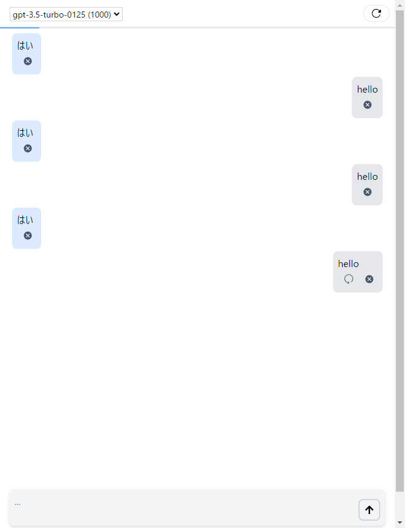

# Simple React AI Chat View Component

React用のAIチャットコンポーネント。


## サンプル

```typescript

function App() {

  const systemPrompt = "hello";
  const fetchAIChatAPI = async (modelName: string, context: ChatContextType): Promise<AIChatResponse> => {
    return { content: "hello", totalTokenCount: 100 }
  }

  const modelList = [
    { modelName: "gpt-3.5-turbo-0125", contextWindow: 1000 },
    { modelName: "model2", contextWindow: 20000 }];

  return (
    <div>
      <AIChatView {...{
        systemPrompt,
        fetchAIChatAPI,
        modelList
      }} />
    </div>
  )
}

export default App


```


## 開発時

```
npm install -g pnpm
pnpm install
pnpm run build
```